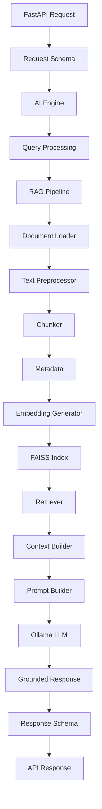

# CARIVIX AI Architecture

This document describes the implemented AI and RAG architecture that is actually present in the project codebase.

## Components

- AI Engine: `rag.pipeline.RAGPipeline` orchestrates loading, splitting, embedding, retrieval, prompt construction, and grounded generation.
- Model Service: `src.model_service.ModelService` handles ML model loading and inference. It is independent from the RAG stack but is integrated by `ai_integration.py`.
- RAG Pipeline: `rag.loader`, `rag.splitter`, `rag.embeddings`, `rag.vector_store`, `rag.retriever`, `rag.prompt_builder`, `rag.generator`.
- Document ingestion: `DocumentLoader` reads `.txt`, `.csv`, `.pdf`, and `.docx` files and attaches metadata.
- Chunking: `DocumentSplitter` uses `RecursiveCharacterTextSplitter` with configurable size and overlap.
- Metadata: every `Document` carries a consistent structure with `document_id`, `file_name`, `source`, `document_type`, `chunk_id`, and `chunk_index`.
- Embeddings: `EmbeddingGenerator` wraps SentenceTransformers and reuses a single model instance.
- FAISS: `VectorStore` persists `index.faiss` and `index.pkl` for vector retrieval.
- Retrieval: `Retriever` turns a user query into an embedding and searches FAISS for top-k matches.
- Context construction: `ContextBuilder` normalizes retrieved chunks and removes duplicates.
- Prompt templates: `PromptBuilder` builds grounded prompts with `SYSTEM INSTRUCTIONS`, `CONTEXT`, `USER QUESTION`, and `ANSWER` sections.
- LLM: `ResponseGenerator` supports Ollama and HuggingFace backends.
- API integration: `ai_integration.py` registers `/api/v1/ai/query` and connects NLP analysis with the RAG flow.

## Configuration

See `rag/config.py` for centralized runtime defaults. Default values follow the project configuration:

- Embedding model: `sentence-transformers/all-MiniLM-L6-v2`
- Embedding dimension: `384`
- Chunk size: `500`
- Chunk overlap: `50`
- Retrieval k: `5`
- Ollama base URL: `http://localhost:11434`

## Notes

This is the actual implementation currently present in the repository and reflects the components that are actively used across the codebase.
